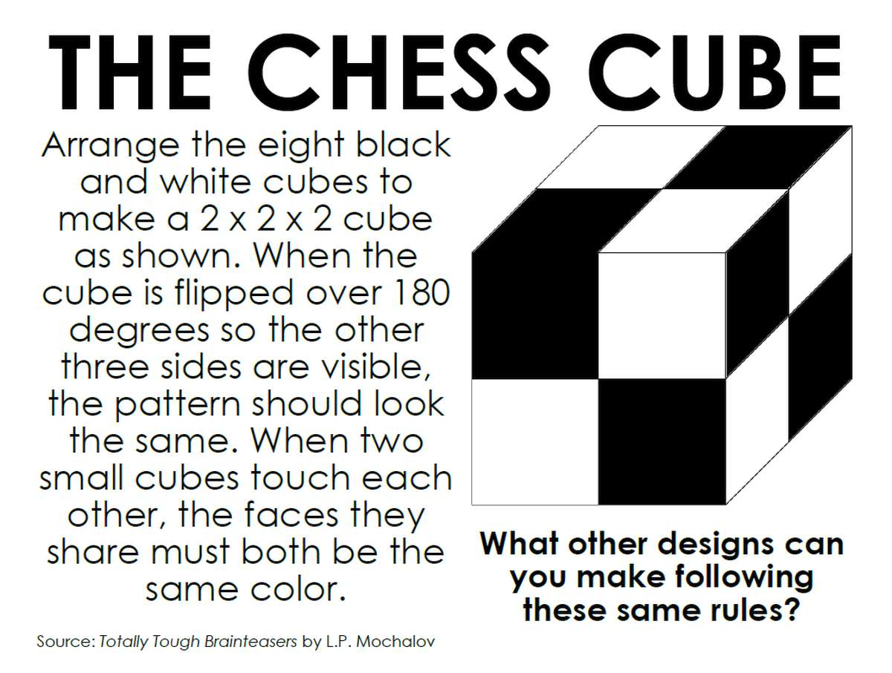
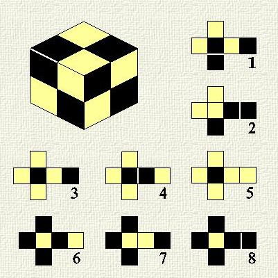

Програма «ChessCube.exe» дозволяє розв’язати однойменну головоломку шахматного куба. Алгоритм полягає в перебиранні всіх можливих комбінацій розташуванні розгорток по позиціях великого куба. Можливі випадки, коли розгортка не підходить у вказану позицію, тоді ця комбінація розгорток не підходить.
Код написаний мовою програмування С++ та реалізований у середовищі розробки Clion.

The ChessCube.exe program allows you to solve the chess cube puzzle of the same name. The algorithm consists in searching for all possible combinations of the arrangement of the scroll on the positions of a large cube. There may be cases where the sweep does not fit in the specified position, then this sweep combination is not suitable.
The code is written in the C++ programming language and implemented in the Clion.

Запустити програму можна через main.

Run the program via main.

